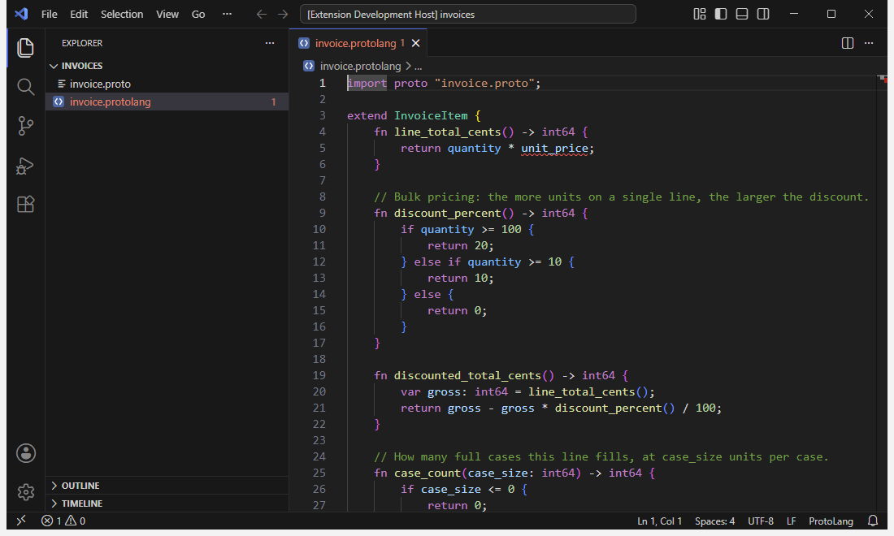

# ProtoLang for Visual Studio Code

Language support for [ProtoLang](https://github.com/IsaacSherman/ProtoLang), which compiles methods
written against protobuf messages into equivalent C# and C++. Everything this extension tells you comes
from the ProtoLang compiler itself, so what the editor says about a file is what a build would say.



## What you get

- Syntax colouring, bracket matching, comment toggling and indentation for `.protolang` files, with or
  without anything else installed.
- With the language server running:
  - live diagnostics as you type, including errors `protoc` reports inside the `.proto` files you import;
  - completion of fields, enum values, names in scope and import paths;
  - hover, go to definition (into `.proto` files too), find all references, highlighting of a name's
    other uses, signature help, and the outline;
  - colouring by meaning, so a field, a parameter and a method look different.
- Saving an imported `.proto` or a `protolang.config.xml` refreshes the diagnostics of open ProtoLang
  files, without you having to type in them.

## Prerequisites

The extension brings its language server but no toolchain. It uses the ones on your machine, so you choose
their versions.

- **.NET 10 or newer**, to run the language server. [Download .NET](https://dotnet.microsoft.com/download).
  Only the runtime is needed. The extension finds `dotnet` through `protolang.dotnetPath`, then
  `DOTNET_ROOT`, then `PATH`, then the usual install locations.
- **`protoc`**, to read the schemas your files import. [Install protoc](https://protobuf.dev/installation/).

**Without .NET**, colouring, brackets and comments still work. The extension tells you once that
the language server could not start. Choose **Use Without the Server**, or set
`protolang.server.enabled` to `false`, and it will not mention it again.

### How `protoc` is found

In order:

1. `protolang.protocPath`, if set. A folder setting wins over a workspace setting, which wins over your
   user setting.
2. The `PROTOLANG_PROTOC` environment variable.
3. `PATH`.
4. A `Grpc.Tools` package in your NuGet package cache.

If none of these finds one, every ProtoLang file that imports a schema says so on its `import` line,
with where the server looked and where to get `protoc`. **ProtoLang: Show Language Server Status**
shows the same explanation.

Relative `PATH` entries such as `.` or `bin` are not searched. The server is started outside your
workspace, with those entries removed, so a `protoc` committed to a repository cannot be found and run
that way. If one of your entries was skipped, the explanation names it.

## Settings

| Setting | Default | What it does |
|---|---|---|
| `protolang.includePaths` | `[]` | Directories searched for imported schemas, after the importing file's own directory. The same as the compiler's `-I`. Relative paths resolve against the workspace folder that states them. |
| `protolang.protocPath` | `""` | The `protoc` to run, as a full path. The same as `PROTOLANG_PROTOC`. Not used in a workspace you have not trusted. |
| `protolang.configPath` | `""` | A `protolang.config.xml` to use instead of searching upward from each file. The same as the compiler's `--config`. |
| `protolang.logLevel` | `info` | How much the server logs: `error`, `warning`, `info` or `trace`. Changing it restarts the server. |
| `protolang.server.enabled` | `true` | Run the language server. Off, only colouring is active and nothing needs .NET. |
| `protolang.server.path` | `""` | A language server to run instead of the bundled one: `protolang-server.dll`, or an executable. For developing the server. User settings only. |
| `protolang.dotnetPath` | `""` | The `dotnet` that runs the server, as a full path. User settings only. |

Include paths, the `protoc` path and the config path can be set per folder in a multi-root workspace. A
change takes effect on the next compilation, with no reload. Language policy, such as overflow
behaviour, is not an editor setting: it lives in `protolang.config.xml` beside your code, so the editor
and your build agree about what the code means.

## Commands

- **ProtoLang: Restart Language Server**
- **ProtoLang: Show Language Server Status**: which `protoc`, which configuration and include paths
  are in effect, what the server has cached, its last error, and how long requests have been taking.
  It still produces a report when the server failed to start or has stopped answering, and says why.
- **ProtoLang: Copy Language Server Status**: copies the whole report. You are shown what it
  contains before anything is copied; it names file paths from your machine, and nothing is sent anywhere.
- **ProtoLang: Show Language Server Log**

If the server crashes, it is restarted automatically, up to four times in three minutes.

## Untrusted workspaces

VS Code asks whether you trust a folder before letting it configure things that could run code. In a
workspace you have not trusted, ProtoLang keeps every feature except one:

- **What stays:** diagnostics, completion, navigation, colouring, include paths and config files.
- **What is withheld:** `protolang.protocPath`. A repository's settings could name any program there,
  and ProtoLang would run it the moment a file opened. Instead, `protoc` is found as if the setting were
  not there: `PROTOLANG_PROTOC`, then `PATH`, then the NuGet package cache.
- **Your own `protolang.protocPath` is withheld too.** VS Code merges user and workspace settings before
  the server sees them, so the server cannot tell which one a value came from.
- `protolang.server.path` and `protolang.dotnetPath` are never read from a workspace, trusted or not.

The first time a setting is withheld you are told once, and the status report lists it. To lift it, run
**Workspaces: Manage Workspace Trust** and trust the folder. The setting takes effect straight away, with no
restart.

## Platforms

Windows, macOS and Linux, wherever .NET 10 runs. The extension and its server are the same on every
platform, and are tested on all three.

## Troubleshooting

- **No diagnostics at all:** run **ProtoLang: Show Language Server Status**. The *Server* section says
  whether the server is running, and the *protoc* section says which `protoc` it found, or why it found
  none.
- **"needs .NET 10 or newer":** install a .NET 10 or newer runtime, or point `protolang.dotnetPath` at
  one.
- **Errors that do not match your build:** check the *Configuration* section of the status report for
  which `protolang.config.xml` and include paths each file is using.

When reporting a problem, include the status report. It names the extension, server, compiler and
editor versions.

## Developing

From `editors/vscode`, with Node.js and the .NET SDK installed:

```bash
npm ci
```

```bash
npm run stage
```

```bash
npm run build
```

```bash
npm test
```

`npm run stage` publishes the server from `src/ProtoLang.LanguageServer` into `server/`. `npm test`
checks types, runs the unit tests, and then starts VS Code to run the end-to-end suite. The first time,
it downloads a copy of VS Code into `.vscode-test/`. `npm run test:server` starts the staged server
under the extension's launch rules and checks what it can find. `npm run package` builds
`dist/protolang.vsix`.
